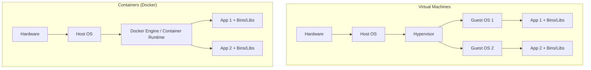
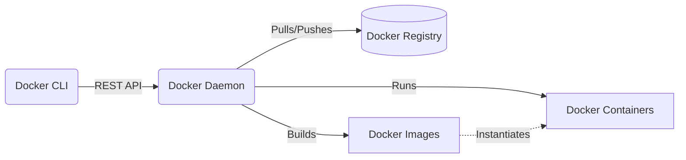

# Docker Comprehensive Technical Study Guide

## Table of Contents
1. [Introduction to Docker](#1-introduction-to-docker)
2. [Core Concepts](#2-core-concepts)
3. [Installation and Setup](#3-installation-and-setup)
4. [Docker CLI Basics](#4-docker-cli-basics)
5. [Docker Images in Depth](#5-docker-images-in-depth)
6. [Containers in Depth](#6-containers-in-depth)
7. [Docker Volumes & Persistent Storage](#7-docker-volumes--persistent-storage)
8. [Docker Networking](#8-docker-networking)
9. [Docker Compose](#9-docker-compose)
10. [Docker Hub & Registries](#10-docker-hub--registries)
11. [Best Practices](#11-best-practices)
12. [Common Mistakes](#12-common-mistakes)
13. [Real-World Examples](#13-real-world-examples)

---

## 1. Introduction to Docker

### What is Docker?
Docker is an open-source platform that enables developers to build, deploy, run, update, and manage containers—standardized, executable components that combine application source code with the operating system (OS) libraries and dependencies required to run that code in any environment. 

Docker simplifies the process of creating and delivering applications by packaging them into self-contained units called **containers**.

### The Problem Docker Solves
Before Docker, developers often faced the infamous **"It works on my machine!"** problem. 
- A developer builds an application on their Windows machine using specific versions of Node.js, libraries, and environment variables.
- They hand the code over to operations/QA to deploy on a Linux server.
- The application crashes because the server has a different OS version, missing dependencies, or conflicting software.

Docker eliminates this by packaging the application and its entire environment into a single, portable unit. If the container runs on the developer's laptop, it is guaranteed to run exactly the same way on a testing server, a production cluster, or a cloud provider.

### Why Containerization is Needed
1. **Consistency Across Environments:** Development, testing, and production environments are identical.
2. **Portability:** Containers can run on any OS that supports the Docker daemon (Linux, Windows, macOS, cloud, on-premises).
3. **Microservices Architecture:** Containers are the ideal vehicle for microservices—small, independent services that communicate over a network. Each service can be containerized, scaled, and deployed independently.
4. **Resource Efficiency:** Containers are lightweight compared to traditional Virtual Machines (VMs).
5. **Rapid Deployment:** Containers start in milliseconds because there is no full OS to boot.
6. **Isolation:** Changes in one container do not affect others running on the same host.

### Containers vs. Virtual Machines (VMs)

A fundamental concept in understanding Docker is distinguishing it from hardware virtualization.

#### Virtual Machines (VMs)
VMs virtualize the physical **hardware**. A hypervisor (like VMware, VirtualBox, or Hyper-V) runs on the host machine and allows multiple Guest Operating Systems to run concurrently. 
- **Pros:** High isolation and security.
- **Cons:** Heavy resource consumption (each VM needs CPU, RAM, and disk space for a full OS). Slow startup times (must boot an entire OS).

#### Containers
Containers virtualize the **Operating System**. The host OS kernel is shared among all containers. 
- **Pros:** Extremely lightweight, fast startup times (milliseconds), minimal resource overhead, higher density (run many more containers than VMs on the same hardware).
- **Cons:** Weaker isolation compared to VMs (they share the same kernel).



| Feature | Virtual Machines | Docker Containers |
| :--- | :--- | :--- |
| **Virtualizes** | Hardware | Operating System |
| **OS Requirement** | Full Guest OS per VM | Shares Host OS Kernel |
| **Size** | Gigabytes (GB) | Megabytes (MB) |
| **Boot Time** | Minutes | Milliseconds |
| **Performance** | Native-like, but has hypervisor overhead | Native performance (no hypervisor overhead) |
| **Isolation** | High (hardware-level) | Medium (process/namespace-level) |
| **Portability** | Lower (tied to hypervisor formats) | High (run anywhere Docker runs) |

---

## 2. Core Concepts

Understanding Docker requires familiarity with its fundamental building blocks and architecture. Docker uses a client-server architecture.

### 1. Docker Daemon (`dockerd`)
The background service running on the host machine. It listens for Docker API requests and manages Docker objects such as images, containers, networks, and volumes.

### 2. Docker Client (`docker`)
The primary way users interact with Docker. When you run a command like `docker run`, the client sends the command to the `dockerd` daemon, which carries it out. The client and daemon can run on the same system, or a client can connect to a remote daemon.

### 3. Docker Images
An image is a read-only template with instructions for creating a Docker container. Think of it as a **class** in Object-Oriented Programming, or a **snapshot** of an environment. 
- Images are built from a `Dockerfile`.
- Images are comprised of multiple **layers**. Each layer represents an instruction in the `Dockerfile`.
- Example: An image might contain an Ubuntu OS, an Apache web server, and your web application code.

### 4. Docker Containers
A container is a runnable instance of an image. Think of it as an **object** instantiated from a class in OOP. 
- You can create, start, stop, move, or delete a container using the Docker API or CLI.
- Containers are isolated from each other and the host machine, but you can control their network and storage bindings.
- When a container is started from an image, a read-write layer is added on top of the image's read-only layers.

### 5. Docker Registries
A registry stores Docker images. 
- **Docker Hub** is the default public registry that anyone can use, and Docker is configured to look for images on Docker Hub by default.
- You can run your own private registry (e.g., AWS ECR, GitHub Container Registry, Azure Container Registry) for proprietary applications.



---

## 3. Installation and Setup

Docker is available across various platforms. The installation process differs depending on your Operating System.

### Windows and macOS
For Windows and macOS, the easiest way to get started is by installing **Docker Desktop**. 
- Docker Desktop provides a GUI and includes the Docker Engine, Docker CLI client, Docker Compose, and Kubernetes.
- **Windows prerequisite:** It is highly recommended to use the **WSL 2 (Windows Subsystem for Linux)** backend rather than Hyper-V for significantly better performance and compatibility.

### Linux (e.g., Ubuntu)
On Linux, you install the Docker Engine directly.

```bash
# 1. Update the apt package index and install packages to allow apt to use a repository over HTTPS:
sudo apt-get update
sudo apt-get install \
    ca-certificates \
    curl \
    gnupg \
    lsb-release

# 2. Add Docker’s official GPG key:
sudo mkdir -p /etc/apt/keyrings
curl -fsSL https://download.docker.com/linux/ubuntu/gpg | sudo gpg --dearmor -o /etc/apt/keyrings/docker.gpg

# 3. Set up the stable repository:
echo \
  "deb [arch=$(dpkg --print-architecture) signed-by=/etc/apt/keyrings/docker.gpg] https://download.docker.com/linux/ubuntu \
  $(lsb_release -cs) stable" | sudo tee /etc/apt/sources.list.d/docker.list > /dev/null

# 4. Install Docker Engine
sudo apt-get update
sudo apt-get install docker-ce docker-ce-cli containerd.io docker-compose-plugin
```

### Post-Installation Step for Linux (Manage Docker as a non-root user)
By default, the Docker daemon binds to a Unix socket owned by `root`. If you want to run `docker` commands without prepending `sudo`, you must add your user to the `docker` group.

```bash
# Create the docker group (may already exist)
sudo groupadd docker

# Add your user to the docker group
sudo usermod -aG docker $USER

# Log out and log back in, or run this command to apply the new group membership
newgrp docker
```

### Verifying the Installation
Run the following command to verify that Docker is installed correctly:

```bash
docker run hello-world
```
If successful, this will pull the `hello-world` image from Docker Hub, run it in a container, print an informational message, and exit.

---

## 4. Docker CLI Basics

The Docker Command Line Interface is powerful and extensive. Commands are generally categorized into management commands (e.g., `docker container`, `docker image`) and traditional commands (e.g., `docker run`, `docker ps`).

### Container Management Commands

#### 1. `docker run`
The most important command. It creates and starts a container based on an image.

```bash
docker run [OPTIONS] IMAGE [COMMAND] [ARG...]
```

**Common Options:**
- `-d` or `--detach`: Run the container in the background and print the container ID.
- `-it`: Interactive mode. `-i` keeps STDIN open, `-t` allocates a pseudo-TTY. Useful for running a shell inside the container.
- `--name [name]`: Assign a custom name to the container instead of a random string.
- `-p [host_port]:[container_port]`: Publish a container's port(s) to the host.
- `-e "KEY=VALUE"`: Set environment variables inside the container.
- `-v [host_path]:[container_path]`: Bind mount a volume.
- `--rm`: Automatically remove the container when it exits.

**Examples:**
```bash
# Run Nginx in the background, mapping host port 8080 to container port 80
docker run -d -p 8080:80 --name my-web-server nginx

# Run an interactive Ubuntu shell, and delete the container when exiting
docker run -it --rm ubuntu bash

# Run a MySQL database with environment variables
docker run -d --name my-db -e MYSQL_ROOT_PASSWORD=secret mysql:8.0
```

#### 2. `docker ps`
Lists running containers.

```bash
# List running containers
docker ps

# List ALL containers (running, stopped, exited, failed)
docker ps -a
```

#### 3. Starting, Stopping, and Restarting
```bash
# Stop a running container gracefully
docker stop <container_id_or_name>

# Force stop a running container immediately
docker kill <container_id_or_name>

# Start a stopped container
docker start <container_id_or_name>

# Restart a container
docker restart <container_id_or_name>
```

#### 4. `docker rm`
Removes a stopped container from the host.

```bash
# Remove a stopped container
docker rm <container_id_or_name>

# Force remove a running container
docker rm -f <container_id_or_name>

# Remove ALL stopped containers
docker container prune
```

#### 5. `docker logs`
Fetches the logs of a container. Very useful for debugging `-d` (detached) containers.

```bash
# Fetch logs
docker logs <container_id_or_name>

# Follow logs continuously (like tail -f)
docker logs -f <container_id_or_name>
```

#### 6. `docker exec`
Executes a new command in a **running** container. Useful for debugging or interacting with a running application.

```bash
# Open an interactive bash shell inside the running container 'my-web-server'
docker exec -it my-web-server bash

# Run a single command without opening a shell
docker exec my-web-server ls -la /usr/share/nginx/html
```

### Image Management Commands

#### 1. `docker images`
Lists the images currently downloaded/built on your local host.

```bash
docker images
```

#### 2. `docker pull`
Downloads an image from a registry (like Docker Hub) without running it.

```bash
docker pull node:18-alpine
```

#### 3. `docker rmi`
Removes an image from the local host. You cannot remove an image if a container (even stopped) is currently using it.

```bash
# Remove an image
docker rmi <image_id_or_name>

# Remove dangling (untagged) images
docker image prune
```

### System Commands

#### 1. `docker system df`
Shows docker disk usage (images, containers, local volumes, build cache).

#### 2. `docker system prune`
**Use with caution!** Removes all stopped containers, unused networks, dangling images, and build cache.
```bash
docker system prune -a --volumes
```

---

## 5. Docker Images in Depth

Images are the blueprints of Docker. Understanding how they are constructed is crucial for building efficient, secure applications.

### The Docker Layer Architecture and Union File System
A Docker image is built up from a series of layers. Each layer represents an instruction in the image's `Dockerfile`. 
When you modify a `Dockerfile` and rebuild the image, Docker only rebuilds the layers that have changed. This is what makes Docker builds fast.

These layers are stacked on top of each other using a **Union File System**. To the user or the running application, it looks like a single, cohesive file system.

### The `Dockerfile`
A `Dockerfile` is a plain text file containing a sequence of instructions used to build an image.

#### Key Instructions

| Instruction | Description | Example |
| :--- | :--- | :--- |
| `FROM` | Defines the base image to build upon. **Must be the first instruction.** | `FROM node:18-alpine` |
| `WORKDIR` | Sets the working directory for any subsequent `RUN`, `CMD`, `ENTRYPOINT`, `COPY`, and `ADD` instructions. | `WORKDIR /app` |
| `COPY` | Copies files or directories from the host machine to the container. | `COPY package.json .` |
| `ADD` | Similar to `COPY` but can also extract tar files and download from URLs. Best practice is to use `COPY` unless these specific features are needed. | `ADD https://example.com/file.tar.gz /tmp/` |
| `RUN` | Executes commands in a new layer and commits the results. Used for installing packages or building code. | `RUN npm install` |
| `ENV` | Sets environment variables within the image. | `ENV NODE_ENV=production` |
| `EXPOSE` | Documents which ports are intended to be published. *Does not actually publish the port.* | `EXPOSE 3000` |
| `USER` | Sets the user name or UID to use when running the image. Good for security (avoid running as root). | `USER node` |
| `CMD` | Provides default arguments or a default execution command for the container. Can be overridden at runtime. | `CMD ["npm", "start"]` |
| `ENTRYPOINT` | Configures a container that will run as an executable. Difficult to override at runtime. Often used together with `CMD`. | `ENTRYPOINT ["python", "app.py"]` |

#### `CMD` vs `ENTRYPOINT` (The source of much confusion)
- `CMD` provides defaults. If you run `docker run my-image`, it runs the `CMD`. If you run `docker run my-image bash`, the `bash` command *overrides* the `CMD`.
- `ENTRYPOINT` specifies the command that *must* run. If an image has `ENTRYPOINT ["ping"]` and `CMD ["localhost"]`, running `docker run my-image google.com` will result in the container running `ping google.com`. The user input overrides `CMD` and appends to `ENTRYPOINT`.

### Building an Image
To build an image from a `Dockerfile`, use the `docker build` command.

```bash
# Build an image named 'my-app' using the Dockerfile in the current directory (.), with the tag 'v1'
docker build -t my-app:v1 .
```

### The `.dockerignore` File
Just like `.gitignore`, the `.dockerignore` file tells Docker which files and directories to ignore when sending the build context (the files in the current directory) to the Docker daemon.
This is critical for:
- Preventing sensitive files (like `.env`) from being baked into the image.
- Speeding up the build process by not sending massive directories (like `node_modules` or `.git`) to the daemon.

**Example `.dockerignore`:**
```text
node_modules
npm-debug.log
.git
.env
Dockerfile
.dockerignore
```

---

## 6. Containers in Depth

While images are static, containers are dynamic. They have a lifecycle and consume resources.

### Container Lifecycle
1. **Created:** Container is created from an image but not yet started (`docker create`).
2. **Running:** The container's main process is executing (`docker start` or `docker run`).
3. **Paused:** The container's processes are frozen, but the container remains in memory (`docker pause`).
4. **Stopped (Exited):** The container's main process has gracefully terminated or crashed (`docker stop` or `docker kill`).
5. **Deleted:** The container is removed from the host (`docker rm`).

### Inspecting Containers
To see deep, low-level details about a container (IP address, volumes, environment variables, state), use `docker inspect`.

```bash
docker inspect <container_name>
```
This returns a massive JSON array. You can use `--format` to filter the output.

```bash
# Get the IP address of a container
docker inspect -f '{{range.NetworkSettings.Networks}}{{.IPAddress}}{{end}}' my-web-server
```

### Resource Constraints
By default, a container has no resource constraints and can use as much of a given resource as the host’s kernel scheduler allows. For production, you should *always* limit memory and CPU.

```bash
# Limit memory to 512 Megabytes, and CPU to 1.5 cores
docker run -d --name my-app --memory="512m" --cpus="1.5" my-image
```

---

## 7. Docker Volumes & Persistent Storage

Containers are **ephemeral** (temporary). When a container is deleted, any data written to its writable layer is deleted with it. If a database container crashes and gets replaced, all the data is lost.

To persist data, Docker provides three options: Volumes, Bind Mounts, and tmpfs mounts.

### 1. Volumes
Volumes are the preferred mechanism for persisting data. They are managed by Docker and are stored in a part of the host filesystem which is managed by Docker (`/var/lib/docker/volumes/` on Linux). Non-Docker processes should not modify this part of the filesystem.

**Pros:**
- Managed by Docker via CLI.
- Can be safely shared among multiple containers.
- Easy to back up or migrate.
- Work well on both Linux and Windows containers.

**Commands:**
```bash
# Create a volume
docker volume create my-db-data

# Run a container and attach the volume
# Format: -v <volume_name>:<container_path>
docker run -d --name my-postgres -v my-db-data:/var/lib/postgresql/data postgres:14
```

### 2. Bind Mounts
Bind mounts allow you to map an exact path on the host system to a path in the container.

**Pros:**
- Excellent for development (mapping your source code directory to the container so you get hot-reloading).

**Cons:**
- Relies on the host machine's directory structure.
- Host files can be unexpectedly modified or deleted by the container process (security risk).

**Commands:**
```bash
# Run a container mapping the current host directory to /app in the container
# Format: -v <absolute_host_path>:<container_path>
docker run -d --name my-node-app -v $(pwd):/app -p 3000:3000 my-node-image
```

### 3. tmpfs Mounts
Stored only in the host system's memory, and are never written to the host system's filesystem. Useful for storing sensitive data temporarily (like credentials or keys) without writing them to disk.

### When to use which?
- **Production Databases/Stateful Apps:** Use **Volumes**.
- **Local Development (Code editing):** Use **Bind Mounts**.
- **Sensitive temporary data:** Use **tmpfs**.

---

## 8. Docker Networking

Docker provides networking features to allow containers to communicate with each other and the outside world.

### Default Network Drivers

1. **`bridge` (Default):** Created automatically. Containers on the same bridge network can communicate via IP address. They cannot communicate via container name (no DNS resolution) on the *default* bridge.
2. **`host`:** Removes network isolation. The container shares the host's networking namespace. If a container binds to port 80, it binds directly to the host's port 80. (Linux only).
3. **`none`:** Completely disables networking for the container.
4. **`overlay`:** Used to connect multiple Docker daemons together (used heavily in Docker Swarm).

### Custom Bridge Networks (The Best Practice)
The default `bridge` network is considered legacy. The best practice is to create a **Custom User-Defined Bridge Network**.

**Why? Automatic DNS Resolution.** 
Containers on a custom network can talk to each other using their container names as hostnames. You don't need to know their IP addresses.

```bash
# 1. Create a custom network
docker network create my-app-network

# 2. Run Database attached to network
docker run -d --name db-server --network my-app-network mongo:5.0

# 3. Run Backend API attached to the same network
# The backend code can now connect to MongoDB using the hostname "db-server"
# e.g., mongodb://db-server:27017/mydb
docker run -d --name backend-api --network my-app-network -p 8080:8080 my-api-image
```

---

## 9. Docker Compose

When building real applications, you rarely run just one container. You usually have a web frontend, a backend API, a database, and maybe a cache (Redis). Running `docker run` commands manually for all of these, creating networks, and attaching volumes becomes extremely tedious and error-prone.

**Docker Compose** is a tool for defining and running multi-container Docker applications using a single YAML file.

### The `docker-compose.yml` File
You define your services, networks, and volumes in a `docker-compose.yml` file.

**Example: Node.js App + PostgreSQL DB**
```yaml
version: '3.8' # The version of the compose file format

services:
  # Service 1: The Database
  db:
    image: postgres:14-alpine
    container_name: app_database
    restart: always
    environment:
      POSTGRES_USER: admin
      POSTGRES_PASSWORD: secretpassword
      POSTGRES_DB: appdb
    volumes:
      - pgdata:/var/lib/postgresql/data
    ports:
      - "5432:5432"

  # Service 2: The Backend API
  api:
    build: 
      context: ./api # Looks for a Dockerfile in the ./api directory
    container_name: app_api
    restart: on-failure
    environment:
      # Compose automatically creates a custom network. 
      # We can connect to the DB using the service name 'db'
      DB_HOST: db 
      DB_USER: admin
      DB_PASSWORD: secretpassword
      DB_NAME: appdb
    ports:
      - "3000:3000"
    depends_on:
      - db # Ensures DB starts before API

volumes:
  pgdata: # Declares the volume used by the db service
```

### Basic Compose Commands

```bash
# Build images, create networks, volumes, and start all containers in the background
docker compose up -d

# View logs for all services
docker compose logs -f

# View logs for a specific service
docker compose logs -f api

# Stop and remove containers, networks (volumes are preserved by default)
docker compose down

# Stop and remove containers, networks, AND volumes (Warning: Data Loss!)
docker compose down -v

# Rebuild images and restart containers (useful if you changed the Dockerfile or code)
docker compose up -d --build
```

---

## 10. Docker Hub & Registries

A Docker Registry is a distribution and storage system for Docker images. **Docker Hub** is the default public registry.

### Working with Docker Hub
To push an image to Docker Hub, you need an account and a repository.

```bash
# 1. Login to Docker Hub via CLI
docker login

# 2. Tag your local image with your Docker Hub username
# Format: docker tag <local-image> <username>/<repository>:<tag>
docker tag my-app:v1 johndoe/my-awesome-app:v1

# 3. Push the image to Docker Hub
docker push johndoe/my-awesome-app:v1
```

### Private Registries
For enterprise applications, you do not want your source code (baked into images) exposed publicly on Docker Hub. You use private registries:
- AWS Elastic Container Registry (ECR)
- Google Artifact Registry
- Azure Container Registry (ACR)
- GitHub Container Registry (GHCR)
- Self-Hosted (e.g., Harbor)

To use these, you authenticate using `docker login <registry-url>`, tag the image with the registry URL, and push.

---

## 11. Best Practices

To create secure, efficient, and professional-grade Docker images, adhere to these best practices.

### Image Optimization

#### 1. Use Minimal Base Images
Avoid using massive OS images like `ubuntu` or `centos` unless strictly necessary. They contain hundreds of MBs of utilities you don't need, which increases build time, storage costs, and attack surface.
- **Use Alpine Linux:** Tagged as `alpine` (e.g., `node:18-alpine`, `python:3.10-alpine`). Alpine is around 5MB.
- **Use Distroless Images:** Even smaller than Alpine, these contain *only* your application and its runtime dependencies. They don't even have a shell (`bash` or `sh`), making them highly secure.

#### 2. Multi-Stage Builds
Compiled languages (Go, Java, C++) and frontend frameworks (React, Angular) need heavy SDKs and tools to build the code, but only need a small runtime or web server to execute the code.

Multi-stage builds allow you to use one image to build the app, and then copy the built artifacts into a tiny runtime image, discarding all the build tools.

```dockerfile
# STAGE 1: Build the React application
FROM node:18-alpine AS builder
WORKDIR /app
COPY package.json package-lock.json ./
RUN npm ci
COPY . .
RUN npm run build

# STAGE 2: Serve the application with Nginx
FROM nginx:alpine
# Copy the build artifacts from the 'builder' stage
COPY --from=builder /app/build /usr/share/nginx/html
EXPOSE 80
CMD ["nginx", "-g", "daemon off;"]
```
*Result:* Instead of a 1GB Node.js image, your final image is a ~20MB Nginx image containing only HTML/JS/CSS.

#### 3. Minimize the Number of Layers
Each `RUN`, `COPY`, and `ADD` instruction creates a new layer. Combine related commands to reduce layers and image size.

**Bad:**
```dockerfile
RUN apt-get update
RUN apt-get install -y python3
RUN apt-get install -y pip
RUN apt-get clean
```

**Good:**
```dockerfile
RUN apt-get update && apt-get install -y \
    python3 \
    pip \
    && apt-get clean \
    && rm -rf /var/lib/apt/lists/*
```

#### 4. Leverage the Build Cache
Docker caches layers. It builds from top to bottom. If a layer changes, all subsequent layers are rebuilt.
**Rule:** Put instructions that change frequently (like copying source code) at the *bottom* of the Dockerfile, and instructions that rarely change (like installing dependencies) at the *top*.

**Good Pattern (Node.js):**
```dockerfile
COPY package.json package-lock.json ./
RUN npm install # This layer is cached unless package.json changes
COPY . . # Source code changes often, so put this AFTER npm install
```

### Security Basics

#### 1. Never Run as Root
By default, Docker containers run as the root user. If an attacker breaches the container, they have root access to the container environment.
Use the `USER` instruction to run the application as a non-privileged user.

```dockerfile
FROM node:18-alpine
WORKDIR /app
COPY . .
RUN npm install
# Switch to the 'node' user provided by the alpine image
USER node 
CMD ["node", "app.js"]
```

#### 2. Don't Hardcode Secrets
Never put passwords, API keys, or database URIs in your `Dockerfile` or commit them to source control. Pass them at runtime using environment variables (`-e`) or Docker Secrets (in Swarm).

#### 3. Scan Images for Vulnerabilities
Use tools like `docker scout`, `Trivy`, or `Clair` to scan your images for known CVEs (Common Vulnerabilities and Exposures) before deploying.
```bash
docker scout cves my-app:latest
```

---

## 12. Common Mistakes

1. **Treating Containers like VMs:** SSH-ing into containers to update software, read logs, or manually change config files. Containers should be immutable. If something needs to change, update the image and redeploy.
2. **Storing Data in the Container:** Not using volumes for databases. The container restarts, and data is lost permanently.
3. **Using the `latest` Tag in Production:** `node:latest` might be Node 18 today, but Node 20 tomorrow. Your build could break unexpectedly. Always pin specific versions (e.g., `node:18.16.0-alpine`).
4. **Ignoring `.dockerignore`:** Baking `node_modules`, `.git` folders, or `.env` files into the image, resulting in massive, insecure images.
5. **Running Multiple Processes in One Container:** Trying to run Apache, MySQL, and PHP in a single container using tools like Supervisord. This breaks the microservice pattern. Use Docker Compose and separate them into three containers.
6. **Not Cleaning Up:** Forgetting to run `docker system prune` occasionally, leading to gigabytes of dead images and exited containers consuming server disk space until the server crashes.

---

## 13. Real-World Examples

### Example 1: Containerizing a Node.js Express API

**Directory Structure:**
```text
my-api/
├── package.json
├── package-lock.json
├── server.js
├── .dockerignore
└── Dockerfile
```

**server.js**
```javascript
const express = require('express');
const app = express();
const PORT = process.env.PORT || 3000;

app.get('/', (req, res) => {
  res.json({ message: "Hello from Docker!" });
});

app.listen(PORT, () => console.log(`Server running on port ${PORT}`));
```

**.dockerignore**
```text
node_modules
.env
npm-debug.log
```

**Dockerfile**
```dockerfile
# 1. Base Image
FROM node:18-alpine

# 2. Set Working Directory
WORKDIR /usr/src/app

# 3. Copy Dependency manifests
COPY package*.json ./

# 4. Install Dependencies (Clean install for production)
RUN npm ci --only=production

# 5. Copy Application Code
COPY . .

# 6. Run as non-root user
USER node

# 7. Document exposed port
EXPOSE 3000

# 8. Define Start Command
CMD ["node", "server.js"]
```

**Commands to Deploy:**
```bash
# Build the image
docker build -t express-api:1.0 .

# Run the container
docker run -d -p 8080:3000 --name api-server express-api:1.0

# Test
curl http://localhost:8080
# Output: {"message":"Hello from Docker!"}
```

### Example 2: Complete Full-Stack Local Development Setup (Compose)

Imagine a setup with a React Frontend, a Python FastAPI Backend, a PostgreSQL Database, and a Redis Cache.

**docker-compose.yml**
```yaml
version: '3.8'

services:
  # 1. The Frontend (React)
  frontend:
    build: 
      context: ./frontend
      dockerfile: Dockerfile.dev
    ports:
      - "3000:3000"
    volumes:
      - ./frontend:/app # Bind mount for hot-reloading
      - /app/node_modules # Anonymous volume to prevent host node_modules from overwriting container's
    environment:
      - REACT_APP_API_URL=http://localhost:8000
    depends_on:
      - backend

  # 2. The Backend (Python FastAPI)
  backend:
    build:
      context: ./backend
    ports:
      - "8000:8000"
    volumes:
      - ./backend:/app # Bind mount for hot-reloading
    environment:
      - DATABASE_URL=postgresql://postgres:password@db:5432/myapp
      - REDIS_URL=redis://cache:6379/0
    depends_on:
      - db
      - cache

  # 3. The Database (PostgreSQL)
  db:
    image: postgres:15-alpine
    environment:
      - POSTGRES_USER=postgres
      - POSTGRES_PASSWORD=password
      - POSTGRES_DB=myapp
    ports:
      - "5432:5432"
    volumes:
      - postgres_data:/var/lib/postgresql/data # Named volume for persistent data

  # 4. The Cache (Redis)
  cache:
    image: redis:7-alpine
    ports:
      - "6379:6379"

# Define the named volumes
volumes:
  postgres_data:
```

**Workflow:**
1. Developer runs `docker compose up -d`.
2. Docker builds the frontend and backend images.
3. Docker pulls Postgres and Redis from Docker Hub.
4. Docker creates an internal network.
5. Docker provisions the persistent volume for the database.
6. All services start in the correct order.
7. As the developer edits code in `./frontend` or `./backend`, the bind mounts ensure the changes are instantly reflected in the running containers.
8. When done, `docker compose down` spins everything down cleanly.

---
*End of Study Guide*
