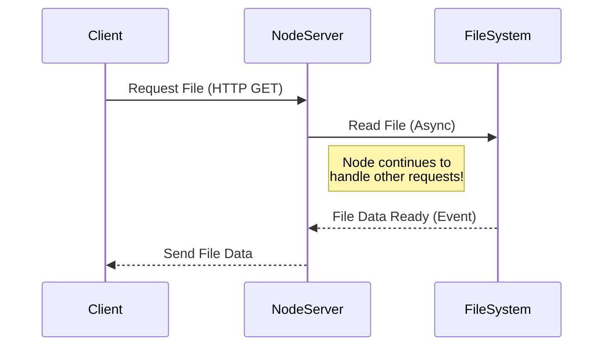

# Comprehensive Node.js Study Guide

Welcome to the comprehensive study guide for Node.js. This guide is designed to take you from a beginner to an intermediate level, focusing on practical understanding, real-world examples, and industry best practices. 

---

## 1. Introduction to Node.js

### What is Node.js?
Node.js is an open-source, cross-platform, back-end JavaScript runtime environment that runs on the V8 engine and executes JavaScript code outside a web browser. Node.js lets developers use JavaScript to write command-line tools and for server-side scripting—running scripts server-side to produce dynamic web page content before the page is sent to the user's web browser.

**Key Characteristics:**
- **Asynchronous and Event-Driven:** All APIs of the Node.js library are asynchronous, that is, non-blocking. It essentially means a Node.js-based server never waits for an API to return data.
- **Single-Threaded but Highly Scalable:** Node.js uses a single-threaded model with event looping. Event mechanism helps the server to respond in a non-blocking way and makes the server highly scalable as opposed to traditional servers which create limited threads to handle requests.
- **Fast:** Being built on Google Chrome's V8 JavaScript Engine, Node.js library is very fast in code execution.
- **No Buffering:** Node.js applications never buffer any data. These applications simply output the data in chunks.

### Why use Node.js?
1. **JavaScript Everywhere:** You can use a single language (JavaScript/TypeScript) for both the frontend and the backend. This unifies web application development around a single programming language.
2. **Rich Ecosystem:** The Node Package Manager (npm) is the largest ecosystem of open-source libraries in the world.
3. **Performance:** Its non-blocking architecture makes it an excellent choice for I/O-heavy applications like real-time chats, streaming platforms, and APIs.
4. **Corporate Support:** Backed by the OpenJS Foundation and supported by major companies like IBM, Microsoft, Netflix, and PayPal.

### Event-driven Architecture
In traditional programming models, code runs sequentially. If a function is waiting for a database to return data, the entire thread blocks. 
Node.js changes this with an **Event-Driven Architecture**.

When an I/O operation starts (like reading a file or making a network request), Node.js hands it off to the system and continues executing the next lines of code. When the operation completes, an "event" is emitted, and a callback function is triggered to handle the result.



---

## 2. Setup and Environment

### Installing Node.js
To start using Node.js, you need to install it on your machine.

1. **Download:** Go to the official [Node.js website](https://nodejs.org/) and download the LTS (Long Term Support) version. LTS is recommended for most users as it guarantees stability and security updates.
2. **Installation:** Run the installer. It will automatically install `node` (the runtime) and `npm` (the package manager).
3. **Verification:** Open your terminal or command prompt and type:

```bash
# Check Node.js version
node -v
# Example output: v20.11.0

# Check npm version
npm -v
# Example output: 10.2.4
```

### Node Version Manager (NVM)
It is a highly recommended best practice to use a version manager like `nvm` (Node Version Manager) or `nvm-windows`. This allows you to install multiple versions of Node.js and easily switch between them depending on your project requirements.

```bash
# Example using nvm
nvm install 20
nvm use 20
```

### Running Scripts
There are two primary ways to execute Node.js code:

**1. The REPL (Read-Eval-Print Loop)**
Typing `node` in your terminal without any arguments opens the REPL. It's an interactive shell where you can type JavaScript code and see the results immediately. Useful for quick tests.
```bash
$ node
Welcome to Node.js v20.11.0.
Type ".help" for more information.
> console.log("Hello World")
Hello World
undefined
> 
```

**2. Running a File**
Create a file named `app.js`:
```javascript
// app.js
console.log('Running Node.js script!');
const math = 2 + 2;
console.log(`2 + 2 = ${math}`);
```
Run it via terminal:
```bash
node app.js
# Output:
# Running Node.js script!
# 2 + 2 = 4
```

---

## 3. Modules

Modules are the building blocks of Node.js applications. A module is essentially a JavaScript file that encapsulates code. This prevents the global scope from being polluted and allows for code reusability. 

There are two module systems in Node.js: **CommonJS (CJS)** and **ECMAScript Modules (ESM)**.

### CommonJS (CJS)
CommonJS is the original module system in Node.js. It uses `require()` to import modules and `module.exports` or `exports` to export them. It is synchronous.

**Exporting (math.js):**
```javascript
// math.js
const add = (a, b) => a + b;
const subtract = (a, b) => a - b;

// Exporting multiple functions as an object
module.exports = {
    add,
    subtract
};

// Alternative way:
// exports.add = add;
// exports.subtract = subtract;
```

**Importing (app.js):**
```javascript
// app.js
const math = require('./math'); // Notice the './' for local files

console.log(math.add(5, 3));      // 8
console.log(math.subtract(10, 4)); // 6
```

### ES Modules (ESM)
ES Modules is the official ECMAScript standard for JavaScript modules. It uses `import` and `export` statements. It is asynchronous and can be statically analyzed.

To use ESM in Node.js, you must either:
1. Use the `.mjs` file extension.
2. Set `"type": "module"` in your `package.json`.

**Exporting (math.js):**
```javascript
// math.js
export const add = (a, b) => a + b;
export const subtract = (a, b) => a - b;

const multiply = (a, b) => a * b;
export default multiply; // Default export
```

**Importing (app.js):**
```javascript
// app.js
import multiply, { add, subtract } from './math.js'; // Extension is required in ESM

console.log(add(5, 3));       // 8
console.log(subtract(10, 4)); // 6
console.log(multiply(2, 4));  // 8
```

> [!TIP]
> **Which one to use?** While CommonJS is heavily prevalent in legacy codebases, the ecosystem is rapidly shifting towards ES Modules. For new projects, it is highly recommended to use ESM (`"type": "module"`).

---

## 4. Core Modules

Node.js comes with a set of built-in modules that you can use without installing external packages.

### `fs` (File System)
The `fs` module allows you to interact with the file system (create, read, update, delete files and directories). It provides both synchronous and asynchronous methods.

```javascript
const fs = require('node:fs'); // Prefixing with 'node:' is a modern best practice

// Asynchronous (Recommended)
fs.readFile('./message.txt', 'utf8', (err, data) => {
    if (err) {
        console.error('Error reading file:', err);
        return;
    }
    console.log('File contents:', data);
});

// Synchronous (Blocks the event loop - use with caution!)
try {
    const data = fs.readFileSync('./message.txt', 'utf8');
    console.log('Sync File contents:', data);
} catch (err) {
    console.error('Error:', err);
}
```

*Note: The `fs/promises` API is often preferred nowadays. We will cover this in the File Handling section.*

### `http`
The `http` module allows Node.js to transfer data over the Hyper Text Transfer Protocol (HTTP). It can create an HTTP server that listens to server ports and gives a response back to the client.

```javascript
const http = require('node:http');

const server = http.createServer((req, res) => {
    res.statusCode = 200;
    res.setHeader('Content-Type', 'text/plain');
    res.end('Hello, World!\n');
});

server.listen(3000, '127.0.0.1', () => {
    console.log('Server running at http://127.0.0.1:3000/');
});
```

### `path`
The `path` module provides utilities for working with file and directory paths. It handles cross-platform path differences (Windows uses `\` while Linux/macOS uses `/`).

```javascript
const path = require('node:path');

const filePath = '/users/john/documents/notes.txt';

console.log(path.basename(filePath)); // notes.txt
console.log(path.dirname(filePath));  // /users/john/documents
console.log(path.extname(filePath));  // .txt

// Joining paths intelligently based on the OS
const newPath = path.join('/users/john', 'pictures', 'avatar.png');
console.log(newPath); // \users\john\pictures\avatar.png (on Windows)

// Resolving absolute paths
const absolute = path.resolve('app.js'); // Returns full path from root C:\...
```

### `os`
The `os` module provides operating system-related utility methods and properties.

```javascript
const os = require('node:os');

console.log('OS Platform:', os.platform()); // 'win32', 'darwin', 'linux'
console.log('CPU Architecture:', os.arch()); // 'x64', 'arm64'
console.log('Total Memory:', (os.totalmem() / 1024 / 1024 / 1024).toFixed(2), 'GB');
console.log('Free Memory:', (os.freemem() / 1024 / 1024 / 1024).toFixed(2), 'GB');
console.log('User Info:', os.userInfo().username);
```

---

## 5. Asynchronous Programming

Asynchronous programming is the heart of Node.js. It prevents the thread from being blocked during I/O operations (like database queries or API calls). There are three main patterns for handling async code in Node.js.

### 1. Callbacks
The oldest approach. A callback is a function passed as an argument to another function, to be executed when the asynchronous operation completes.

**Error-First Callback Pattern:** In Node.js, the convention is that the first argument of the callback is reserved for an error object. If the operation succeeds, this argument is `null`.

```javascript
const fs = require('node:fs');

// Error-first callback
fs.readFile('./data.json', 'utf8', (err, data) => {
    if (err) {
        // Handle error
        console.error('Failed to read file:', err.message);
        return;
    }
    
    // Process data
    try {
        const parsed = JSON.parse(data);
        console.log(parsed);
    } catch (parseErr) {
        console.error('Failed to parse JSON:', parseErr.message);
    }
});
```
**Drawback:** "Callback Hell" or the "Pyramid of Doom." When you have multiple asynchronous operations that depend on each other, callbacks get deeply nested and hard to maintain.

### 2. Promises
A Promise is an object representing the eventual completion (or failure) of an asynchronous operation. It can be in one of three states: `Pending`, `Fulfilled`, or `Rejected`.

Promises solve callback hell by chaining `.then()` and `.catch()`.

```javascript
const fs = require('node:fs/promises'); // Use the promise-based fs API

fs.readFile('./data.json', 'utf8')
    .then(data => {
        return JSON.parse(data); // Returns a new promise resolving to parsed data
    })
    .then(parsedData => {
        console.log('User name:', parsedData.name);
        return fs.writeFile('./output.txt', `Processed: ${parsedData.name}`);
    })
    .then(() => {
        console.log('File written successfully');
    })
    .catch(err => {
        // Catches errors from ANY of the promises in the chain above
        console.error('An error occurred:', err);
    });
```

### 3. Async / Await
Introduced in ES2017, `async/await` is syntactic sugar on top of Promises. It allows you to write asynchronous code that *looks* synchronous, making it far easier to read and reason about.

- `async` keyword makes a function return a Promise.
- `await` keyword pauses the execution of the `async` function until the Promise resolves or rejects.

```javascript
const fs = require('node:fs/promises');

async function processData() {
    try {
        // Execution pauses here until readFile finishes
        const data = await fs.readFile('./data.json', 'utf8');
        const parsed = JSON.parse(data);
        
        console.log('User name:', parsed.name);
        
        // Execution pauses here until writeFile finishes
        await fs.writeFile('./output.txt', `Processed: ${parsed.name}`);
        console.log('File written successfully');
        
    } catch (err) {
        // Error handling is done with standard try/catch blocks
        console.error('An error occurred:', err);
    }
}

processData();
```
> [!IMPORTANT]
> Always use `async/await` with `try/catch` blocks. Unhandled promise rejections can crash your Node.js application.

---

## 6. Event Loop

The Event Loop is what allows Node.js to perform non-blocking I/O operations despite the fact that JavaScript is single-threaded.

When Node.js starts, it initializes the event loop. When you run an async operation (like `fs.readFile`), Node.js passes the operation to the operating system (which is multi-threaded). When the OS finishes the operation, it puts the associated callback function into the Event Queue. The Event Loop continuously checks the queue and pushes callbacks onto the Call Stack when the stack is empty.

### Phases of the Event Loop
The event loop runs in specific phases. Each phase has a FIFO queue of callbacks to execute.

1. **Timers:** Executes callbacks scheduled by `setTimeout()` and `setInterval()`.
2. **Pending Callbacks:** Executes I/O callbacks deferred to the next loop iteration (e.g., TCP errors).
3. **Idle, Prepare:** Only used internally.
4. **Poll:** Retrieves new I/O events; executes I/O related callbacks (almost all with the exception of close callbacks, the ones scheduled by timers, and `setImmediate()`).
5. **Check:** Executes `setImmediate()` callbacks.
6. **Close Callbacks:** Executes close events, e.g., `socket.on('close', ...)`.

```javascript
const fs = require('node:fs');

console.log('1. Script start');

setTimeout(() => {
    console.log('2. setTimeout 0ms');
}, 0);

setImmediate(() => {
    console.log('3. setImmediate');
});

fs.readFile(__filename, () => {
    console.log('4. fs.readFile callback (I/O)');
    
    // Inside an I/O callback, setImmediate always runs before setTimeout
    setTimeout(() => {
        console.log('5. setTimeout inside I/O');
    }, 0);
    
    setImmediate(() => {
        console.log('6. setImmediate inside I/O');
    });
});

console.log('7. Script end');

/* Expected Output:
1. Script start
7. Script end
2. setTimeout 0ms (Order of 2 and 3 can vary if not in I/O phase)
3. setImmediate
4. fs.readFile callback (I/O)
6. setImmediate inside I/O (Guaranteed to run before 5)
5. setTimeout inside I/O
*/
```

---

## 7. Working with HTTP

While the built-in `http` module is powerful, it is quite low-level. In the real world, developers almost always use web frameworks like **Express.js**, **Fastify**, or **NestJS** to handle HTTP servers. 

However, understanding the core `http` module is crucial.

### Creating a Raw HTTP Server

```javascript
const http = require('node:http');

const PORT = process.env.PORT || 3000;

const server = http.createServer((req, res) => {
    // 1. Inspect the Request
    const { method, url } = req;
    console.log(`${method} request to ${url}`);

    // 2. Routing
    if (url === '/' && method === 'GET') {
        res.writeHead(200, { 'Content-Type': 'application/json' });
        res.end(JSON.stringify({ message: 'Welcome to the Home Page' }));
    } 
    else if (url === '/api/users' && method === 'GET') {
        const users = [{ id: 1, name: 'Alice' }, { id: 2, name: 'Bob' }];
        res.writeHead(200, { 'Content-Type': 'application/json' });
        res.end(JSON.stringify(users));
    }
    // 3. Handling POST Requests (Requires reading streams)
    else if (url === '/api/users' && method === 'POST') {
        let body = '';
        
        // Listen for data chunks
        req.on('data', chunk => {
            body += chunk.toString();
        });
        
        // When all data is received
        req.on('end', () => {
            try {
                const parsedBody = JSON.parse(body);
                res.writeHead(201, { 'Content-Type': 'application/json' });
                res.end(JSON.stringify({ message: 'User created', user: parsedBody }));
            } catch (err) {
                res.writeHead(400, { 'Content-Type': 'application/json' });
                res.end(JSON.stringify({ error: 'Invalid JSON' }));
            }
        });
    }
    // 4. 404 Not Found
    else {
        res.writeHead(404, { 'Content-Type': 'application/json' });
        res.end(JSON.stringify({ error: 'Route not found' }));
    }
});

server.listen(PORT, () => {
    console.log(`Server listening on port ${PORT}`);
});
```

Notice how verbose it is to read a JSON body in raw Node.js. Frameworks like Express handle this automatically.

---

## 8. File Handling

Modern Node.js file handling heavily relies on the `fs/promises` module.

### Reading and Writing

```javascript
const fs = require('node:fs/promises');
const path = require('node:path');

async function manageFiles() {
    const filePath = path.join(__dirname, 'test.txt');
    
    try {
        // 1. Write to a file (Creates if it doesn't exist, overwrites if it does)
        await fs.writeFile(filePath, 'Hello from Node.js!\n', 'utf8');
        console.log('File written.');

        // 2. Append to a file
        await fs.appendFile(filePath, 'Appending this new line.\n', 'utf8');
        console.log('File appended.');

        // 3. Read the file
        const data = await fs.readFile(filePath, 'utf8');
        console.log('File contents:\n', data);

        // 4. Check file stats (size, creation time)
        const stats = await fs.stat(filePath);
        console.log(`File size: ${stats.size} bytes`);
        console.log(`Is directory? ${stats.isDirectory()}`);

        // 5. Delete the file
        await fs.unlink(filePath);
        console.log('File deleted.');

    } catch (err) {
        console.error('File operation failed:', err);
    }
}

manageFiles();
```

### Working with Directories

```javascript
const fs = require('node:fs/promises');

async function manageDirs() {
    const dirPath = './my_new_folder';
    
    try {
        // Create directory
        await fs.mkdir(dirPath, { recursive: true }); // recursive prevents error if exists
        console.log('Directory created');
        
        // Read directory contents
        const files = await fs.readdir('.');
        console.log('Current directory contains:', files);
        
        // Remove empty directory
        await fs.rmdir(dirPath);
        // Use fs.rm(dirPath, { recursive: true }) for non-empty directories
        console.log('Directory removed');
    } catch (err) {
        console.error('Directory error:', err);
    }
}
```

---

## 9. Streams and Buffers

For handling small files, `fs.readFile` and `fs.writeFile` are fine. They read the entire file into memory (RAM) before giving it to you. 
However, if you are reading a 5GB video file on a server with 1GB of RAM, `fs.readFile` will crash your server (Out of Memory).

**Streams** are a way to handle reading/writing files, network communications, or any kind of end-to-end information exchange in an efficient way. Streams process data piece by piece (in **Buffers**) rather than holding everything in memory.

### The Four Types of Streams
1. **Readable:** Streams from which data can be read (e.g., `fs.createReadStream()`).
2. **Writable:** Streams to which data can be written (e.g., `fs.createWriteStream()`).
3. **Duplex:** Streams that are both Readable and Writable (e.g., net sockets).
4. **Transform:** Duplex streams that can modify or transform the data as it is written and read (e.g., `zlib.createGzip()`).

### Buffers
A Buffer is a chunk of memory allocated outside the V8 JavaScript engine. It represents a fixed-length sequence of bytes. Streams move data in Buffers.

### Using Read and Write Streams
```javascript
const fs = require('node:fs');

// Reading a large file chunk by chunk
const readStream = fs.createReadStream('./large-file.txt', { encoding: 'utf8' });
const writeStream = fs.createWriteStream('./copy-of-large-file.txt');

readStream.on('data', (chunk) => {
    // This event fires every time a new chunk (buffer) is read
    console.log(`Received a chunk of ${chunk.length} bytes`);
    
    // Write the chunk to the new file
    writeStream.write(chunk);
});

readStream.on('end', () => {
    console.log('Finished reading file.');
    writeStream.end(); // Close the write stream
});

readStream.on('error', (err) => {
    console.error('Error reading:', err);
});
```

### Piping Streams
A much cleaner way to connect a Readable stream directly to a Writable stream is using the `.pipe()` method.

```javascript
const fs = require('node:fs');

const readStream = fs.createReadStream('./large-file.txt');
const writeStream = fs.createWriteStream('./piped-copy.txt');

// Automatically handles the data flow, preventing memory bottlenecks (backpressure)
readStream.pipe(writeStream);

writeStream.on('finish', () => {
    console.log('Piping completed!');
});
```

---

## 10. Error Handling

Proper error handling is vital in Node.js to prevent the server from crashing unexpectedly.

### Synchronous Errors (Try/Catch)
For synchronous code, standard `try...catch` blocks work perfectly.

```javascript
function divide(a, b) {
    if (b === 0) throw new Error('Division by zero');
    return a / b;
}

try {
    divide(10, 0);
} catch (err) {
    console.error('Caught error:', err.message);
}
```

### Asynchronous Errors (Promises/Async-Await)
With Async/Await, you also use `try...catch`. 

```javascript
async function fetchData() {
    try {
        const response = await fetch('https://invalid-url.com');
        const data = await response.json();
    } catch (err) {
        // This catches network errors or JSON parsing errors
        console.error('Failed to fetch:', err);
    }
}
```

### Uncaught Exceptions and Unhandled Rejections
If an error is thrown and not caught anywhere, it reaches the top of the Event Loop and crashes the Node.js process. You can set up global safety nets, but **you should still let the app crash and restart it** (using a process manager like PM2) because the app is in an unpredictable state.

```javascript
// Catch unhandled Promise rejections (e.g., missing .catch() on a Promise)
process.on('unhandledRejection', (reason, promise) => {
    console.error('CRITICAL: Unhandled Rejection at:', promise, 'reason:', reason);
    // Perform cleanup, then exit
    process.exit(1);
});

// Catch uncaught synchronous exceptions
process.on('uncaughtException', (err) => {
    console.error('CRITICAL: Uncaught Exception:', err);
    // Perform cleanup, then exit
    process.exit(1);
});
```

---

## 11. Package Management

**npm (Node Package Manager)** is the default package manager for Node.js. It consists of a command-line client and an online database of public and private packages (the npm registry).

### Initializing a Project
To start using npm in a project, you create a `package.json` file. This file tracks your project's dependencies, metadata, and scripts.

```bash
# Interactive setup
npm init

# Quick setup (accepts all defaults)
npm init -y
```

### Installing Packages
Dependencies are external libraries your code needs to run.

```bash
# Install a package locally (added to dependencies in package.json)
npm install express

# Install a package as a Development Dependency (only needed for dev/testing, e.g., nodemon, jest)
npm install nodemon --save-dev

# Install a specific version
npm install lodash@4.17.21

# Install globally (available system-wide as a CLI tool)
npm install -g pm2
```

### `package.json` vs `package-lock.json`
- **`package.json`**: Lists the packages your project needs, with semantic versioning rules (e.g., `^1.2.3` meaning "any version compatible with 1.2.3").
- **`package-lock.json`**: Automatically generated. It locks the exact versions of all installed packages and their sub-dependencies. This ensures that every developer on the team (and the production server) installs the exact same code. **Always commit this file to Git.**

### NPM Scripts
You can define custom CLI commands in your `package.json`.

```json
{
  "name": "my-app",
  "version": "1.0.0",
  "scripts": {
    "start": "node server.js",
    "dev": "nodemon server.js",
    "test": "jest"
  },
  "dependencies": {
    "express": "^4.18.2"
  },
  "devDependencies": {
    "nodemon": "^3.0.0"
  }
}
```
Run them via:
```bash
npm start
npm run dev # Need 'run' for custom scripts other than start/test
```

---

## 12. Environment Variables

Hardcoding sensitive data (API keys, database passwords) or environment-specific config (ports, URLs) into your code is a massive security risk and bad practice. Instead, use Environment Variables.

In Node.js, environment variables are accessed via the `process.env` object.

### Using `.env` Files
The standard approach is to use a `.env` file at the root of your project and the `dotenv` package to load them.

1. **Install dotenv:**
   ```bash
   npm install dotenv
   ```

2. **Create a `.env` file:**
   ```env
   PORT=8080
   DB_HOST=localhost
   DB_USER=admin
   DB_PASS=supersecret123
   JWT_SECRET=mysecrettoken
   ```

3. **Load variables in your code:**
   ```javascript
   // Ensure this is at the very top of your entry file!
   require('dotenv').config();

   const port = process.env.PORT || 3000;
   const dbPassword = process.env.DB_PASS;

   console.log(`Starting server on port ${port}`);
   ```

> [!CAUTION]
> **Never commit your `.env` file to Git!** Always add `.env` to your `.gitignore` file. You can provide a `.env.example` file with dummy values so other developers know what variables are required.

---

## 13. Debugging

`console.log` is great, but sometimes you need real debugging tools to pause execution and inspect memory.

### The Node.js Inspector
Node.js has a built-in debugging client that integrates perfectly with Chrome DevTools and VS Code.

1. **Start with the inspect flag:**
   ```bash
   node --inspect-brk server.js
   ```
   *`--inspect-brk` stops the code execution on the very first line.*

2. **Using Chrome DevTools:**
   - Open Google Chrome.
   - Go to `chrome://inspect`.
   - Click "Open dedicated DevTools for Node".
   - You can now set breakpoints, step through code, and inspect variables exactly like frontend JavaScript.

3. **Using VS Code:**
   - VS Code has excellent built-in Node.js debugging.
   - Simply click the "Run and Debug" panel on the left (or press F5).
   - Select "Node.js". It will attach automatically, allowing you to set breakpoints directly in your editor.

---

## 14. Best Practices

To write professional, scalable, and secure Node.js applications, follow these guidelines:

### Code Structure & Architecture
- **Layered Architecture:** Do not put all your business logic, database queries, and routing in one file. Separate them:
  - `Routes`: Map URLs to Controller functions.
  - `Controllers`: Extract data from HTTP requests and pass it to Services.
  - `Services`: The core business logic.
  - `Models/Data Access`: Code that actually touches the database.
- **Modularity:** Keep files small and focused on a single responsibility.
- **Use `async/await`:** Avoid callback hell. Use promises and async/await for all asynchronous code.

### Security Basics
- **Never Run as Root:** In production, run your Node process as an unprivileged user.
- **Sanitize Input:** Never trust user input. Use validation libraries (like Joi, Zod, or express-validator) to prevent SQL Injection or XSS.
- **Use Helmet.js:** If using Express, use the `helmet` package to automatically set secure HTTP headers.
- **Rate Limiting:** Implement rate limiting (e.g., `express-rate-limit`) to prevent Brute Force and DDoS attacks.
- **Update Dependencies:** Regularly run `npm audit` to check for known vulnerabilities in your dependencies.

### Performance
- **Don't Block the Event Loop:** CPU-intensive tasks (image processing, heavy math, cryptography) will block the event loop, freezing your server for all users. Offload these tasks to **Worker Threads** or separate microservices.
- **Use Caching:** Use Redis to cache frequently accessed, rarely changing data.
- **Use a Process Manager:** Never run `node server.js` directly in production. Use PM2 (`npm install -g pm2`) to manage your process. PM2 will automatically restart your app if it crashes and allows you to run multiple instances in a Cluster.

---

## 15. Common Mistakes

1. **Forgetting to return after sending a response:**
   ```javascript
   app.get('/api', (req, res) => {
       if (!req.query.id) {
           res.status(400).send('ID required');
           // MISTAKE: Code continues executing below if you don't return!
       }
       
       // Fix: use 'return res.status(400)...'
       res.status(200).send('Success'); // This will cause a "Headers already sent" error
   });
   ```

2. **Blocking the Event Loop with Synchronous Code:**
   Using `fs.readFileSync` or large `for` loops in the middle of a request handler will freeze the server for everyone else.

3. **Callback Hell:**
   Nesting callbacks instead of using Promises/Async-Await.

4. **Ignoring Errors:**
   Empty catch blocks or not handling Promise rejections can lead to silent failures and memory leaks.

5. **Not configuring `.npmrc` or `.gitignore`:**
   Accidentally committing `node_modules/` or `.env` to GitHub.

---

## 16. Real-world Examples

### Example 1: Building a robust API with Express.js

While the core `http` module is good to know, Express is the industry standard for APIs. 

**Setup:**
```bash
npm init -y
npm install express cors dotenv
npm install nodemon --save-dev
```

**Code (`server.js`):**
```javascript
require('dotenv').config();
const express = require('express');
const cors = require('cors');

const app = express();
const PORT = process.env.PORT || 5000;

// Middleware
app.use(cors()); // Allow Cross-Origin requests
app.use(express.json()); // Parse incoming JSON payloads

// Mock Database
let users = [
    { id: 1, name: 'John Doe', role: 'Admin' },
    { id: 2, name: 'Jane Smith', role: 'User' }
];

// Routes

// 1. GET all users
app.get('/api/users', (req, res) => {
    res.status(200).json({
        success: true,
        count: users.length,
        data: users
    });
});

// 2. GET single user by ID
app.get('/api/users/:id', (req, res) => {
    // req.params contains URL parameters
    const user = users.find(u => u.id === parseInt(req.params.id));
    
    if (!user) {
        return res.status(404).json({ success: false, error: 'User not found' });
    }
    
    res.status(200).json({ success: true, data: user });
});

// 3. POST create new user
app.post('/api/users', (req, res) => {
    const { name, role } = req.body;
    
    // Basic validation
    if (!name || !role) {
        return res.status(400).json({ success: false, error: 'Please provide name and role' });
    }
    
    const newUser = {
        id: users.length + 1,
        name,
        role
    };
    
    users.push(newUser);
    
    res.status(201).json({ success: true, data: newUser });
});

// Global Error Handler Middleware
app.use((err, req, res, next) => {
    console.error(err.stack);
    res.status(500).json({ success: false, error: 'Server Error' });
});

// Start server
app.listen(PORT, () => {
    console.log(`Server running in ${process.env.NODE_ENV || 'development'} mode on port ${PORT}`);
});
```

### Example 2: Working with the File System via API

A common use case is uploading or manipulating files through an API. Here is a simple example of saving logs to a file via an endpoint.

```javascript
const express = require('express');
const fs = require('node:fs/promises');
const path = require('node:path');

const app = express();
app.use(express.json());

const LOG_FILE = path.join(__dirname, 'server-logs.txt');

app.post('/api/log', async (req, res) => {
    const { event, details } = req.body;

    if (!event) {
        return res.status(400).json({ error: 'Event name is required' });
    }

    const logEntry = `[${new Date().toISOString()}] EVENT: ${event} | DETAILS: ${details || 'none'}\n`;

    try {
        // Append to the log file asynchronously
        await fs.appendFile(LOG_FILE, logEntry, 'utf8');
        res.status(200).json({ success: true, message: 'Log saved' });
    } catch (error) {
        console.error('Failed to write log:', error);
        res.status(500).json({ success: false, error: 'Failed to write to file system' });
    }
});

app.listen(3000, () => console.log('Logging Server running on port 3000'));
```

---

## Conclusion

This study guide provides a comprehensive overview of Node.js fundamentals, architectural concepts, and practical implementations. By mastering these core topics—from the Event Loop and Async programming to Streams and robust API design—you are well-equipped to build highly scalable and performant backend systems using Node.js. Continue practicing by building small projects, exploring the npm ecosystem, and moving into full-fledged frameworks like Express or NestJS.
