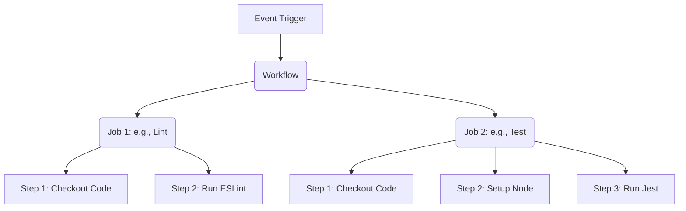

# GitHub Actions: The Comprehensive Technical Study Guide

Welcome to the definitive, comprehensive guide to mastering GitHub Actions. This document is engineered for developers, DevOps practitioners, and engineers who want to deeply understand how to automate their software development lifecycles directly within GitHub.

This guide spans from foundational CI/CD philosophies to advanced deployment orchestration and security best practices.

---

## Table of Contents

1. [Introduction to CI/CD](#1-introduction-to-cicd)
2. [Introduction to GitHub Actions](#2-introduction-to-github-actions)
3. [Core Concepts](#3-core-concepts)
4. [Workflow Syntax](#4-workflow-syntax)
5. [Running Jobs](#5-running-jobs)
6. [Using Actions](#6-using-actions)
7. [Environment Variables and Secrets](#7-environment-variables-and-secrets)
8. [Building and Testing](#8-building-and-testing)
9. [Deployment](#9-deployment)
10. [Debugging Workflows](#10-debugging-workflows)
11. [Best Practices](#11-best-practices)
12. [Common Mistakes](#12-common-mistakes)
13. [Real-world Examples](#13-real-world-examples)

---

## 1. Introduction to CI/CD

Before diving into GitHub Actions, it is imperative to understand the underlying philosophy it enables: **Continuous Integration, Continuous Delivery, and Continuous Deployment (CI/CD)**.

### What is CI/CD?

CI/CD is a method to frequently deliver apps to customers by introducing automation into the stages of app development. The main concepts attributed to CI/CD are:

#### Continuous Integration (CI)
Continuous Integration is a coding philosophy and set of practices that drive development teams to implement small changes and check in code to version control repositories frequently.
- **Goal:** Establish a consistent and automated way to build, package, and test applications.
- **Mechanism:** Every time a developer commits code, an automated system builds the application and runs a suite of tests (unit, integration, linting).
- **Benefit:** Detects bugs and integration issues early. If a build fails, the team knows immediately that the recent commit broke the application.

#### Continuous Delivery (CD)
Continuous Delivery picks up where Continuous Integration ends. It automates the delivery of applications to selected infrastructure environments.
- **Goal:** Ensure the software can be released reliably at any time.
- **Mechanism:** Automated deployments to staging or pre-production environments. The code is in a deployable state, but pushing it to production usually requires a manual approval or trigger.
- **Benefit:** Reduces the friction, risk, and time associated with releasing software.

#### Continuous Deployment (CD)
Continuous Deployment goes one step further than Continuous Delivery.
- **Goal:** Fully automate the path to production.
- **Mechanism:** Every change that passes all stages of your production pipeline is released to your customers automatically, without human intervention.
- **Benefit:** Accelerates the feedback loop with customers and eliminates the manual "release day" pressure.

### Why Automation is Important

> [!NOTE]
> Automation isn't just about saving time; it's about reducing cognitive load and establishing an unbreakable safety net for your codebase.

1. **Consistency:** Automated systems perform tasks exactly the same way every time. Manual processes are prone to human error (e.g., forgetting to run a specific test suite).
2. **Speed:** Automation compiles code, runs tests, and deploys faster than any human operator could.
3. **Feedback Loop:** Developers receive instant notification if their changes break something, allowing them to fix issues while the context is fresh in their minds.
4. **Confidence:** Knowing that rigorous automated tests have passed gives teams the confidence to merge and deploy code rapidly.
5. **Traceability:** Automated pipelines log every step, providing an audit trail of exactly what was deployed, when, and by whom.

---

## 2. Introduction to GitHub Actions

GitHub Actions is a powerful automation platform integrated directly into GitHub. It allows you to automate your software workflow, from code reviews and branch management to testing and deployment.

### What is GitHub Actions?

Traditionally, CI/CD required third-party tools (like Jenkins, CircleCI, or Travis CI) integrated with your code repository via webhooks. GitHub Actions eliminates this boundary by offering a native CI/CD execution environment directly within GitHub.

- It is an API for cause and effect on GitHub: orchestrate any workflow, based on any event, while GitHub manages the execution, provides rich feedback, and secures every step in the process.
- Workflows are defined in YAML files stored in your repository under `.github/workflows/`.

### Use Cases

GitHub Actions is incredibly versatile. While primarily known for CI/CD, its deep integration with GitHub events makes it useful for much more:

1. **CI/CD Pipelines:** Automatically testing code on Pull Requests, building artifacts, and deploying to AWS, Azure, Google Cloud, or Vercel.
2. **Repository Management:** Automatically labeling issues based on content, closing stale pull requests, or assigning reviewers.
3. **Automated Publishing:** Publishing packages to npm or the GitHub Packages registry when a new release is tagged.
4. **Scheduled Tasks:** Running daily security scans, database backups, or sending summary reports to Slack.
5. **Community Management:** Greeting first-time contributors with automated welcome messages.

---

## 3. Core Concepts

To build effective workflows, you must understand the structural hierarchy of GitHub Actions. The architecture is composed of six primary concepts.

### 1. Workflows
A workflow is a configurable automated process that will run one or more jobs.
- **Definition:** Defined by a YAML file checked into your repository.
- **Location:** Must live in the `.github/workflows/` directory.
- **Execution:** Triggered by an event, manually, or on a defined schedule.

### 2. Events
An event is a specific activity in a repository that triggers a workflow run.
- **Examples:** A push commit, opening a pull request, creating an issue, or an external system triggering a repository dispatch webhook.

### 3. Jobs
A job is a set of steps in a workflow that execute on the same runner.
- **Execution Environment:** Each job runs in its own distinct virtual machine (runner) or container.
- **Parallelism:** By default, jobs with no dependencies run in parallel.
- **Dependencies:** You can configure jobs to run sequentially by defining dependencies using the `needs` keyword.

### 4. Steps
A step is an individual task that can run commands in a job.
- **Nature:** A step can be either an action or a shell command.
- **Data Sharing:** Because all steps in a job execute on the same runner, they share data (like the file system). This means a step that checks out code makes that code available to the next step that builds it.

### 5. Actions
An action is a custom application for the GitHub Actions platform that performs a complex but frequently repeated task.
- **Reusability:** Actions are the building blocks of jobs. You can use actions created by GitHub, the open-source community, or create your own.
- **Examples:** `actions/checkout` (pulls your repository code), `actions/setup-node` (installs a specific Node.js version).

### 6. Runners
A runner is a server that runs your workflows when they're triggered.
- **GitHub-hosted Runners:** Pre-configured virtual machines managed by GitHub (Ubuntu, Windows, macOS).
- **Self-hosted Runners:** Your own machines (physical, virtual, or containerized) that you register with GitHub to run jobs. Useful when you need specific hardware, custom operating systems, or access to private internal networks.

### Hierarchy Visualization



---

## 4. Workflow Syntax

GitHub Actions workflows are defined using YAML (YAML Ain't Markup Language). YAML is sensitive to indentation, so maintaining proper spacing is crucial.

### YAML Basics
- **Key-Value Pairs:** Separated by a colon and a space `key: value`.
- **Lists (Arrays):** Indicated by a hyphen `-`.
- **Dictionaries (Objects):** Indicated by indentation.
- **Comments:** Start with `#`.

### The `name` Keyword
Defines the name of the workflow as it will appear in the GitHub Actions UI.

```yaml
name: Production Deployment Pipeline
```

### The `on` Keyword (Triggers)
The `on` keyword specifies the events that trigger the workflow. This is where GitHub Actions shines due to its deep integration with repository events.

#### 1. Push and Pull Request Events
The most common triggers. You can scope these triggers to specific branches, tags, or file paths.

```yaml
on:
  push:
    branches:
      - main
      - 'releases/**' # Matches releases/v1, releases/v2, etc.
    paths:
      - 'src/**'      # Only run if files in src/ are changed
      - '!src/docs/**' # Do NOT run if only files in src/docs/ changed
  pull_request:
    branches:
      - main
    types: [opened, synchronize, reopened]
```

#### 2. Scheduled Events
Allows you to trigger workflows at specific times using POSIX cron syntax.

```yaml
on:
  schedule:
    # Runs at 02:00 UTC every day
    - cron: '0 2 * * *'
```

#### 3. Manual Triggers
You can trigger workflows manually from the GitHub UI using `workflow_dispatch`. You can even define inputs for the user to provide when triggering.

```yaml
on:
  workflow_dispatch:
    inputs:
      environment:
        description: 'Environment to deploy to'
        required: true
        default: 'staging'
        type: choice
        options:
          - staging
          - production
      debug_mode:
        description: 'Enable verbose logging'
        required: false
        type: boolean
```

#### 4. Webhook Events (Repository Dispatch)
Trigger workflows from external systems via an API call.

```yaml
on:
  repository_dispatch:
    types: [custom_webhook_event]
```

### The `jobs` Keyword
The `jobs` section contains one or more jobs. Each job requires an identifier (e.g., `build`, `test_and_lint`).

```yaml
jobs:
  build_application: # Job ID
    name: Build Application
    runs-on: ubuntu-latest
    steps:
      - name: Hello World
        run: echo "Building application..."
```

---

## 5. Running Jobs

Jobs represent the core execution environments of your workflow. Understanding how to configure runners, parallelism, and matrices is key to optimizing CI/CD.

### Runners

Every job must define a runner environment using the `runs-on` keyword.

#### GitHub-Hosted Runners
GitHub provides ready-to-use virtual machines with a vast array of pre-installed software (Node, Python, Docker, Git, etc.).

- `ubuntu-latest` (Currently points to Ubuntu 22.04 or 24.04 depending on GH updates)
- `windows-latest`
- `macos-latest`

```yaml
jobs:
  build-linux:
    runs-on: ubuntu-latest
  build-windows:
    runs-on: windows-latest
```

> [!TIP]
> Always prefer `ubuntu-latest` unless you are specifically building iOS/macOS apps (requires macOS runners, which consume action minutes much faster) or Windows-specific applications (.NET Framework, Windows containers). Ubuntu runners are faster and cheaper.

### Parallel and Sequential Jobs

By default, all jobs in a workflow run simultaneously in parallel. This significantly speeds up workflows. However, deployments usually depend on successful builds.

Use the `needs` keyword to create dependencies between jobs.

```yaml
jobs:
  lint:
    runs-on: ubuntu-latest
    steps:
      - run: echo "Linting code..."

  test:
    runs-on: ubuntu-latest
    steps:
      - run: echo "Testing code..."

  deploy:
    runs-on: ubuntu-latest
    needs: [lint, test] # This job waits for lint and test to complete successfully
    steps:
      - run: echo "Deploying code..."
```

### Matrix Builds

A matrix strategy lets you use variables in a single job definition to automatically create multiple job runs that are based on the combinations of the variables. This is incredibly powerful for testing across multiple language versions or OS platforms.

```yaml
jobs:
  test:
    runs-on: ${{ matrix.os }}
    strategy:
      matrix:
        os: [ubuntu-latest, windows-latest, macos-latest]
        node-version: [16.x, 18.x, 20.x]
        # Exclude specific combinations if needed
        exclude:
          - os: macos-latest
            node-version: 16.x
    steps:
      - uses: actions/checkout@v4
      - name: Use Node.js ${{ matrix.node-version }}
        uses: actions/setup-node@v4
        with:
          node-version: ${{ matrix.node-version }}
      - run: npm ci
      - run: npm test
```

In the example above, GitHub Actions will automatically spawn 8 parallel jobs (3 OS * 3 Node versions - 1 excluded combination).

---

## 6. Using Actions

Actions are the secret sauce of the ecosystem. They abstract away complex scripting into simple, reusable blocks.

### Marketplace Actions

The GitHub Marketplace contains thousands of pre-built actions.

To use an action, use the `uses` keyword within a step. You can also pass inputs to an action using the `with` keyword.

```yaml
steps:
  # 1. Checkout the repository code
  - name: Checkout Code
    uses: actions/checkout@v4

  # 2. Setup a specific version of Python
  - name: Setup Python 3.11
    uses: actions/setup-python@v5
    with:
      python-version: '3.11'
      cache: 'pip' # Automatically caches pip dependencies!

  # 3. Use a third-party action to send a Slack message
  - name: Send Slack Notification
    uses: rtCamp/action-slack-notify@v2
    env:
      SLACK_WEBHOOK: ${{ secrets.SLACK_WEBHOOK_URL }}
```

### Action Versioning (Security & Stability)

When utilizing actions, you specify a version. There are three ways to do this, ranging from least to most secure:

1. **Branch (Unsafe):** `uses: actions/checkout@main` (Could break unexpectedly if the author pushes a breaking change to main).
2. **Tag (Standard):** `uses: actions/checkout@v4` (Safe, assumes semantic versioning, will get minor/patch updates).
3. **Commit SHA (Most Secure):** `uses: actions/checkout@b4ffde65f46336ab88eb53be808477a3936bae11` (Immutable. Highly recommended for security-critical workflows or strictly regulated environments).

> [!WARNING]
> If you are building a repository with high security requirements (e.g., enterprise applications), always pin third-party actions to the exact commit SHA. Tags can theoretically be deleted and forcefully pushed to point to malicious code by an attacker who compromises an action author's account.

### Custom Actions (Basic Intro)

If you find yourself writing the same complex bash scripts repeatedly across workflows, you should create a custom action.

Types of custom actions:
1. **Composite Actions:** The easiest to create. They simply group multiple workflow steps into one reusable action.
2. **JavaScript Actions:** Written in Node.js. Fast execution because Node.js is pre-installed on runners.
3. **Docker Container Actions:** Package your environment and code into a Docker container. Ensures exact dependencies are met, but slower to start up due to image pulling/building.

**Example of a Composite Action (`action.yml` in your repo):**
```yaml
name: 'Install Dependencies and Build'
description: 'Standardizes our npm build process'
runs:
  using: "composite"
  steps:
    - name: Install
      run: npm ci
      shell: bash
    - name: Build
      run: npm run build
      shell: bash
```

---

## 7. Environment Variables and Secrets

Modern applications require configuration data and secrets (API keys, database passwords). GitHub Actions provides a robust system for managing these.

### Default Environment Variables

GitHub automatically injects dozens of environment variables into every runner. You can use these in your shell scripts.
- `GITHUB_WORKSPACE`: The default working directory for steps and the default location of your repository when using checkout.
- `GITHUB_SHA`: The commit SHA that triggered the workflow.
- `GITHUB_REF_NAME`: The branch or tag name that triggered the workflow.

```yaml
steps:
  - name: Print branch name
    run: echo "We are running on branch $GITHUB_REF_NAME"
```

### Custom Environment Variables

You can define custom environment variables at three levels:
1. **Workflow level:** Available to all jobs.
2. **Job level:** Available to all steps within that job.
3. **Step level:** Available only to that specific step.

```yaml
env:
  GLOBAL_VAR: "Accessible everywhere"

jobs:
  job_one:
    env:
      JOB_VAR: "Accessible in job_one steps"
    runs-on: ubuntu-latest
    steps:
      - name: Step One
        env:
          STEP_VAR: "Only accessible here"
        run: |
          echo $GLOBAL_VAR
          echo $JOB_VAR
          echo $STEP_VAR
```

### Secrets Management

**NEVER HARDCODE SECRETS IN YOUR REPOSITORY CODE OR YAML FILES.**

GitHub Secrets are encrypted environment variables. You configure them in your repository settings (`Settings -> Secrets and variables -> Actions`).

- **Repository Secrets:** Available to all workflows in the repo.
- **Environment Secrets:** Available only to jobs that explicitly target an "Environment" (e.g., production). Useful for enforcing deployment protection rules.
- **Organization Secrets:** Shared across multiple repositories in an organization.

**Using Secrets in Workflows:**
To use a secret, you inject it into the environment using the `${{ secrets.SECRET_NAME }}` syntax.

```yaml
steps:
  - name: Deploy to Server
    run: ./deploy.sh
    env:
      API_KEY: ${{ secrets.PRODUCTION_API_KEY }}
      DB_PASSWORD: ${{ secrets.DB_PASSWORD }}
```

> [!NOTE]
> GitHub Actions automatically redacts secrets from the workflow logs. If your script accidentally prints `echo $API_KEY`, the log will display `echo ***`.

---

## 8. Building and Testing

The core of Continuous Integration is validating that the code works.

### Running Tests

To run tests, you typically:
1. Check out the code.
2. Set up the language environment (Node, Python, Go, etc.).
3. Install dependencies.
4. Execute the test runner.

**Example: Node.js Testing Pipeline**
```yaml
name: Node.js CI

on:
  push:
    branches: [ "main" ]
  pull_request:
    branches: [ "main" ]

jobs:
  test:
    runs-on: ubuntu-latest
    steps:
    - uses: actions/checkout@v4
    
    - name: Use Node.js
      uses: actions/setup-node@v4
      with:
        node-version: '20.x'
        cache: 'npm' # Critical for speed!
        
    - name: Install dependencies
      run: npm ci # Use ci instead of install for reliable builds
      
    - name: Run linter
      run: npm run lint
      
    - name: Run tests
      run: npm test
```

### Build Pipelines and Artifacts

Often, a build process creates files you want to save (compiled binaries, distribution folders, test coverage reports). These files are called **Artifacts**.

Because each job runs on a fresh virtual machine, data is lost when the job ends. To share data between jobs or to download it later, use the `upload-artifact` and `download-artifact` actions.

```yaml
jobs:
  build:
    runs-on: ubuntu-latest
    steps:
      - uses: actions/checkout@v4
      - run: npm ci
      - run: npm run build # Creates a 'dist/' folder
      
      # Upload the dist folder
      - name: Upload Build Artifact
        uses: actions/upload-artifact@v4
        with:
          name: production-build
          path: dist/
          retention-days: 7

  deploy:
    needs: build
    runs-on: ubuntu-latest
    steps:
      # Download the previously uploaded artifact
      - name: Download Build Artifact
        uses: actions/download-artifact@v4
        with:
          name: production-build
          path: dist/ # Places it back in the dist directory
          
      - name: Deploy to Server
        run: echo "Deploying contents of dist/..."
```

---

## 9. Deployment

Continuous Deployment involves pushing your validated, built application to a live server.

### Deploying Apps

Deployment strategies vary wildly based on your architecture. You might use `rsync` over SSH to a VPS, push a Docker image to an orchestrator, or use cloud-specific CLI tools (AWS CLI, Azure CLI).

Many cloud providers offer official actions to simplify this:
- `aws-actions/configure-aws-credentials`
- `azure/login`
- `google-github-actions/auth`

### Environments and Protection Rules

For robust CD, GitHub offers **Environments**. An environment can have protection rules and environment-specific secrets.

For example, you can require manual approval from a specific team before a deployment to the `production` environment can proceed.

```yaml
jobs:
  deploy_production:
    runs-on: ubuntu-latest
    needs: [build, test]
    # Target the 'production' environment
    environment:
      name: production
      url: https://my-production-app.com # Optional URL integration in GH UI
    steps:
      - uses: actions/checkout@v4
      - name: Deploy
        run: ./deploy-to-prod.sh
```

If the `production` environment is configured to require manual approval, the workflow will pause indefinitely at the `deploy_production` job until an authorized user clicks "Approve" in the GitHub UI.

### Security via OIDC (OpenID Connect)

Historically, deploying to AWS/Azure required saving long-lived credentials (Access Keys) as GitHub Secrets. This is a security risk if keys are compromised or forgotten.

The modern best practice is **OIDC**. OIDC allows your GitHub workflow to request a short-lived access token directly from the cloud provider, completely eliminating the need for stored secrets.

```yaml
# To use OIDC, you must grant the workflow 'id-token: write' permissions
permissions:
  id-token: write
  contents: read

steps:
  - name: Configure AWS Credentials via OIDC
    uses: aws-actions/configure-aws-credentials@v4
    with:
      role-to-assume: arn:aws:iam::1234567890:role/GitHubActionsRole
      aws-region: us-east-1
```

---

## 10. Debugging Workflows

Workflows will inevitably fail. Debugging them effectively is a critical skill.

### 1. Enabling Debug Logging
By default, GitHub truncates extensive logs. You can enable deep diagnostic logging by setting repository secrets:
- Create a repository secret named `ACTIONS_STEP_DEBUG` and set its value to `true`.
- Create a repository secret named `ACTIONS_RUNNER_DEBUG` and set its value to `true`.

Once set, re-run the workflow, and you will see vastly more detailed execution logs in the UI.

### 2. Using SSH to Debug (tmate)
Sometimes, logs aren't enough, and you need to poke around the virtual machine itself. You can pause the workflow and SSH into the runner using the `action-tmate` tool.

> [!CAUTION]
> Remove this step before merging to production, as it halts the pipeline.

```yaml
steps:
  - uses: actions/checkout@v4
  # ... some failing step ...
  
  - name: Setup tmate session
    if: ${{ failure() }} # Only run this if previous steps failed
    uses: mxschmitt/action-tmate@v3
```
This action will print an SSH command in the logs. Run that command in your local terminal, and you will have a live root shell on the GitHub runner to inspect files and run commands manually.

### 3. Using act for Local Testing
Testing workflows by constantly pushing commits to GitHub is slow ("commit-driven development"). You can use an open-source tool called [act](https://github.com/nektos/act) to run your GitHub Actions locally using Docker.

```bash
# Run the 'push' event locally
act push
```

---

## 11. Best Practices

To maintain scalable, secure, and fast pipelines, adhere to these practices:

### 1. Keep Workflows DRY (Reusable Workflows)
If you have multiple microservices with identical build processes, don't duplicate the YAML. Use **Reusable Workflows**.
A reusable workflow is triggered using `workflow_call`.

**shared-build.yml:**
```yaml
on:
  workflow_call:
    inputs:
      node_version:
        required: true
        type: string
jobs:
  build:
    runs-on: ubuntu-latest
    steps:
      - uses: actions/checkout@v4
      - uses: actions/setup-node@v4
        with:
          node-version: ${{ inputs.node_version }}
      - run: npm ci && npm run build
```

**service-a-pipeline.yml:**
```yaml
on: [push]
jobs:
  call-shared-build:
    uses: ./.github/workflows/shared-build.yml
    with:
      node_version: '20.x'
```

### 2. Implement the Principle of Least Privilege (`permissions`)
By default, the `GITHUB_TOKEN` provided to workflows has extensive read/write permissions to your repository. This is dangerous if a workflow is compromised.

Always explicitly define the permissions your workflow needs. If you only need to read code, restrict it.

```yaml
# At the top level of your workflow
permissions:
  contents: read # Can read code, but cannot push code, manipulate issues, or write packages
```

### 3. Optimize Execution Time with Caching
Downloading dependencies (like `node_modules` or `.m2` for Java) takes time. Use `actions/cache` to save these between runs. Modern language setup actions (`setup-node`, `setup-python`) have caching built-in via the `cache` input, which is the preferred method.

### 4. Use Dependabot for Actions
Just like NPM packages, third-party actions receive updates and security patches. Enable Dependabot in your repository settings to automatically create PRs when actions used in your workflows have new versions available.

---

## 12. Common Mistakes

Avoid these frequent pitfalls when building workflows:

1. **Hardcoding Secrets in Scripts:** Never do `run: curl -H "Auth: my_secret_key"`. Always use `${{ secrets.MY_SECRET }}`.
2. **Ignoring Security of 3rd-Party Actions:** Don't use actions from unknown developers without reviewing the code. A malicious action can steal your secrets or push backdoored code to your repo. Pin by SHA for high-security environments.
3. **Overusing GitHub-Hosted Runners for Heavy Lifting:** If your build takes 2 hours and requires 64GB of RAM, do not use standard GitHub runners (you will run out of minutes/credits rapidly, and standard runners only have 7GB RAM). Use self-hosted runners or GitHub Larger Runners.
4. **Using `npm install` Instead of `npm ci`:** In CI environments, always use `npm ci`. `npm install` can modify the `package-lock.json` and result in non-deterministic builds. `npm ci` strictly adheres to the lockfile.
5. **Failing to Handle Context Injection Safely:** Be careful when echoing user input (like PR titles) in bash scripts, as it can lead to script injection attacks.
   *Bad:* `run: echo "Title: ${{ github.event.pull_request.title }}"`
   *Good:* Map it to an env variable first.
   ```yaml
   env:
     TITLE: ${{ github.event.pull_request.title }}
   run: echo "Title: $TITLE"
   ```

---

## 13. Real-world Examples

Here are two complete, production-ready workflow examples.

### Example 1: Node.js CI/CD to GitHub Container Registry (Docker)

This workflow runs on pushes to `main`. It lints, tests, builds a Docker container, and pushes it to the GitHub Container Registry (GHCR).

```yaml
name: Node.js CI and Docker Publish

on:
  push:
    branches: [ "main" ]
  pull_request:
    branches: [ "main" ]

env:
  REGISTRY: ghcr.io
  IMAGE_NAME: ${{ github.repository }}

jobs:
  test-and-lint:
    runs-on: ubuntu-latest
    steps:
      - uses: actions/checkout@v4
      - name: Setup Node
        uses: actions/setup-node@v4
        with:
          node-version: '20.x'
          cache: 'npm'
      - name: Install Dependencies
        run: npm ci
      - name: Lint
        run: npm run lint
      - name: Test
        run: npm run test:coverage

  build-and-push-docker:
    needs: test-and-lint # Wait for tests to pass!
    # Only run this job if pushing to main (don't push docker images for PRs)
    if: github.event_name == 'push' && github.ref == 'refs/heads/main'
    runs-on: ubuntu-latest
    permissions:
      contents: read
      packages: write # Needed to push to GHCR

    steps:
      - name: Checkout repository
        uses: actions/checkout@v4

      - name: Log in to the Container registry
        uses: docker/login-action@v3
        with:
          registry: ${{ env.REGISTRY }}
          username: ${{ github.actor }}
          password: ${{ secrets.GITHUB_TOKEN }} # Auto-provided by GitHub

      - name: Extract metadata (tags, labels) for Docker
        id: meta
        uses: docker/metadata-action@v5
        with:
          images: ${{ env.REGISTRY }}/${{ env.IMAGE_NAME }}
          tags: |
            type=sha,format=long
            type=raw,value=latest

      - name: Build and push Docker image
        uses: docker/build-push-action@v5
        with:
          context: .
          push: true
          tags: ${{ steps.meta.outputs.tags }}
          labels: ${{ steps.meta.outputs.labels }}
          cache-from: type=gha
          cache-to: type=gha,mode=max
```

### Example 2: Scheduled Stale Issue Management

This workflow runs on a schedule (cron) rather than a push. It keeps the repository clean by automatically labeling and closing issues that have been inactive for weeks.

```yaml
name: Close Stale Issues

on:
  schedule:
    # Run at 1:30 AM every day
    - cron: '30 1 * * *'
  # Allow manual triggering for testing
  workflow_dispatch:

permissions:
  issues: write
  pull-requests: write

jobs:
  stale:
    runs-on: ubuntu-latest
    steps:
      - uses: actions/stale@v9
        with:
          repo-token: ${{ secrets.GITHUB_TOKEN }}
          stale-issue-message: 'This issue is stale because it has been open 30 days with no activity. Remove stale label or comment or this will be closed in 5 days.'
          days-before-stale: 30
          days-before-close: 5
          stale-issue-label: 'status: stale'
          exempt-issue-labels: 'status: blocked, status: keep-open'
          operations-per-run: 100 # Prevent hitting API rate limits on first run
```

---

## Conclusion

GitHub Actions represents a paradigm shift in how developers approach automation. By bringing the compute environment directly into the version control system, it removes the friction of maintaining external CI/CD servers. 

Mastering GitHub Actions requires understanding its event-driven nature, leveraging the rich ecosystem of community actions, and strictly adhering to security and performance best practices. Whether you are running a simple linter or orchestrating a complex, multi-cloud microservices deployment, GitHub Actions provides the primitives to build robust, scalable automation.
